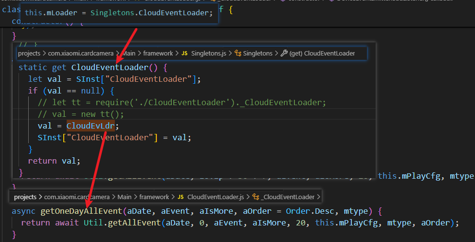
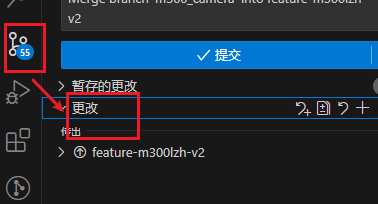
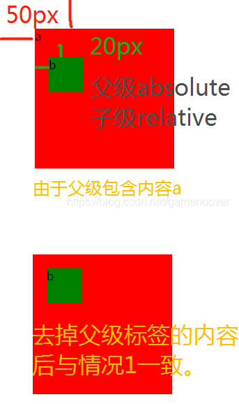

*2024/06/20 Thu*
# 环境配置
## 基本流程参考
https://iot.mi.com/new/doc/accesses/direct-access/extension-development/quick-start/the-first-extension

略去*2. 配置RN 开发环境*即可
## 使用nvm管理node版本
https://blog.csdn.net/weixin_57844432/article/details/127788884
此处推荐14版本，通过[Node官网](https://nodejs.org/zh-cn)查阅可知支持的版本为v14.12.3

*注意：*
需要执行两次npm install，一次在sdk环境根目录下进行，另一次在插件根目录下进行
在进行npm install后需要进行额外一个操作：
1. 找出所有的`import { turn } from '../../../../bin/local-cli/bundle/bundleCommandLineArgs';`语句加以注释
    turn没有被使用，同时该路径不存在
    共有两处
    1. D:\miot-plugin-sdk\projects\com.xiaomi.camera.demoLi\Main\aicamera\OneKeyCallPage.js
    2. D:\miot-plugin-sdk\projects\com.xiaomi.camera.demoLi\Main\setting\FaceManagerNumber.js

# 尝试运行
0. 询问git哪个分支
1. 将git下来的`camera_rn_plugin`代码文件夹重命名为`com.xiaomi.cardcamera`的形式
2. 从GitHub下拉取`miot-plugin-sdk`SDK环境
3. 将1中重命名的文件夹移入2中SDK环境文件夹下的projects文件夹中
4. 可以使用`npm start com.xiaomi.xxx.xxx`运行指定插件
5. 运行时遇到相关依赖缺失时使用`npm install xxx --save`进行安装

# 米家APP上的操作
0. 将设备接入米家APP
1. 将小米账号添加为开发者账号（找mentor）
2. 重启米家APP，重新登陆账号，甚至清楚米家APP全部数据，多尝试一下。最后在米家APP-我的中下拉到最后能找到**RN开发者选项**
3. 进入开发者选项后点击开发者模式
    + 使用IP连接电脑主机
    + 点击右上角+号添加设备
        + package为运行的插件的包名（即`com.xiaomi.xxx.xxx`）
        + model询问mentor
4. 点击下方开启开发者模式后，返回首页进入设备，（在此之前已经使用`npm start`启动了插件）这时程序会自动编译运行。


*2024/06/21 Fre*
TODO:梳理代码，尝试测试
     问一下mentor 1. turn是不是没有用 2. SD卡是不是必须

+ 主界面在/live/LiveVideoPageV2.js中绘制，render中通过一个`<View></View>`绘制整个界面。
    + 按界面看划分为顶部导航栏、视频流、
    
## git
```git
git branch 查看当前分支
git branch -r 查看所有分支
git checkout -b|-B <new-branch> [<start-point>] 从startPoint新建一个分支

```

*2024/06/24 Mon*
## 开启摄像头得到画面的路径： connect --> bindp2p --> video:start
摄像头与米家APP使用P2P点对点传输，摄像头相关API在`D:\SDKEnv\miot-plugin-sdk\miot-sdk\service\miotcamera.js`中    
[P2P 点对点传输](https://iot.mi.com/new/doc/accesses/direct-access/extension-development/extension-functions/p2p#1.%20%E5%BC%95%E5%85%A5P2P%20%E7%82%B9%E5%AF%B9%E7%82%B9%E4%BC%A0%E8%BE%93%E5%8A%9F%E8%83%BD%E6%A8%A1%E5%9D%97)
1. 首先使用connectToDeviceWithStateChangeCallBack建立插件与摄像机固件之间的P2P连接
2. 其次使用bindP2PCommandReceiveCallback 通知米家App 命令回复值通过这个callback回调给插件，相当于摄像机发送命令时直接接受方是米家APP 需要告诉米家App使用该回调函数将命令返回给插件
3. 最后使用sendP2PCommandToDevice向设备发送start指令
4. 使用disconnectToDevice(did)断开米家APP建立的P2P连接
#### 从现有分支创建一个新分支，并切换到新分支下
```shell
git checkout 现有分支名 #切换分支
git checkout -b 新分支名
```
#### 删除分支：`git branch -d 分支名`

## git基本操作、分支管理、查看提交历史学习
## 学习使用sonarqube扫描本地项目代码

D:\rn-plugin\miot-workspace\projects\com.xiaomi.cardcamera\Main\aicamera\DailyStoryVideoViewPage.js   line673
D:\rn-plugin\miot-workspace\projects\com.xiaomi.cardcamera\Main\aicamera\MonitorDurationListPage.js   line407

D:\rn-plugin\miot-workspace\projects\com.xiaomi.cardcamera\Main\aicamera\OneKeyCallPage.js            line3682
Main/sdcard/CloudTimelinePlayerFragment.js                                                            line1254
Main/sdcard/SdcardTimelinePlayerFragment.js                                                           line1452

*2024/06/25 Tue*
# 修Bug
### 主要接触到三类bug
1. set方法不需要返回值-->删除return即可
2. 逻辑与&的错误使用 --> 只使用了一个&，按照代码意图应该是&&进行约束
3. map方法中没有使用到返回值 --> 使用forEach方法代替，删除return语句
4. 三元表达式的true or false返回值相同 --> 类似于白天与黑夜模式切换的场景，应该匹配不同的资源，询问mentor后先不予处理
5. 三元表达式一个分支为null或空操作 --> 改写为if语句？/ 做不修改的赋值操作？

## Sonar配置及问题
在扫描js项目中。对于遇到java文件的处理办法
在项目中发现是`@react-native-community`依赖中的`android`文件夹下包含`.java`文件
### sonar-project.properties
```Java Properties
sonar.sourceEncoding=UTF-8
sonar.projectKey=locl_proj
sonar.sources=.
sonar.host.url=http://10.38.218.49
sonar.login=squ_d735d7e232b532416c5d0ed048b38f9337bf13f0
sonar.branch.name=master
sonar.projectVersion=1.0.0
sonar.exclusions=**/*.java
```
## 遇到的React18严格模式特性引发的问题
### New Strict Mode Behaviors
https://zh-hans.react.dev/blog/2022/03/29/react-v18#new-strict-mode-behaviors
React18在新的严格模式下，在开发环境中，引入了更严格的检查机制，当第一次挂载组件时，react模拟组件的卸载和重新挂载的过程。这会导致一些请求重复发送，进而触发CanceledError的错误
```
canceled
CanceledError: canceled
    at throwIfCancellationRequested (http://localhost:3000/static/js/vendors-node_modules_axios_lib_axios_js.chunk.js:1462:11)
    at Axios.dispatchRequest (http://localhost:3000/static/js/vendors-node_modules_axios_lib_axios_js.chunk.js:1474:3)
    at async Axios.request (http://localhost:3000/static/js/vendors-node_modules_axios_lib_axios_js.chunk.js:811:14)
    at Axios.request (http://localhost:3000/static/js/vendors-node_modules_axios_lib_axios_js.chunk.js:815:41)
```
解决方案：
1. 放弃`StrictMode`，在`index.js/index.ts`中将`<React.StrictMode>`组件删除
2. 另一种方案是使用useRef hook来存储状态，这样第二次加载时会更新状态

*2024/06/26 Wed*
# 开发主题设置界面
删去原有的息屏显示Switch,改为主题设置,并开发二级设置界面
二级设置界面继承自BaseSettingPage
### 进行一些代理设置
1. 在index.js中设置对应跳转路径
2. RouteProxy.js注册代理
### 对BaseSettingPage的一些使用
1. 使用construct继承属性,并在this.state中定义'私有属性'
2. 使用getTitle方法规定页面标题
3. 使用renderSettingContent方法规定界面需要渲染的设置内容
    + 在BaseSettingPage中已经定义了最外层的View和ScrollView标签


## 二级界面的开发
1. 使用米家组件ListItem显示`数字时钟` `时间显示` `历法设置` `天气` `指针时钟`功能界面，具体业务逻辑实现还有待完善
2. ListItem组件下一些属性的设置：
    + title：主标题
    + value：组件值，若有箭头则紧邻箭头左侧显示
    + showSeparator：是否显示分割线
    + hideArrow：是否显示最右侧箭头
    + subtitle：是否显示副标题（主标题下面小号字体，不加粗）
3. 使用RN原生组件Image显示图片，~~但是横向滑动的图像列表的完成还有待探索~~使用ScrollView组件，设置horizontal属性为true。尝试使用scollbars属性隐藏滚动条

*2024/06/27 Thur*
# 写周报
# 继续开发主题设置界面
1. 使用ScrollView组件完成横向滑动的列表，设置horizontal属性为true。~~目前不能隐藏滑动条~~showsHorizontalScrollIndicator设置水平滚动条显示与否。
2. 要使用this.setState更新State才会触发dom的更新
3. View上没有onPress方法，可以套一层TouchableWithoutFeedback使用其onPress方法

*2024/06/28 Fre*
# [Git操作学习](https://learngitbranching.js.org/?locale=zh_CN)
## git 主要命令
+ git commit 提交修改记录
+ git branch + git checkout    
创建分支 + 切换分支    
git checkout -b 新分支名 现有分支名（可选，默认为当前分支） -- 从某个分支创建新分支并切换到新分支下     
git branch -f <分支名> <提交名> 可以让该分支指向某个提交

+ git merge <分支名>      
创建一个当前节点的子节，将<分支名>合并到当前分支下

+ git rebase <分支名1> <分支名2>(默认为当前分支)  
线性合并分支，复制<分支名2>的提交记录，放在<分支名1>指向的节点之后

## git 特性
+ 分离HEAD -- 使用git checkout <节点哈希值> 移动HEAD指向    
+ 相对引用
    + 向上移动一位 -- ^     
    例如`git checkout main^`
    + 移动多位~\<num\>    
    例如`git checkout HEAD~4`
+ 撤销变更
    + git reset <节点哈希值>/<相对位置> 退回到`<节点哈希值>/<相对位置>`的对应位置，本地仓库不知道该位置后面还有节点
    
    + git revert <节点哈希值>/<相对位置> 撤销`<节点哈希值>/<相对位置>`的更改并分享给他人 --> 引入一个新提交来记录撤销了之前的提交
    
+ **自由修改提交树
    + git cherry-pick <提交号>...    
    将`<提交号>...`中所列的提交节点依次复制到当前节点下
    + git rebase -i   -->   交互式界面
+ git tag <标签名> <提交记录名>/<分支名> 为提交记录或分支当前指向打上标签
    + git describe <ref>     
    \<ref> 可以是任何能被 Git 识别成提交记录的引用，如果你没有指定的话，Git 会使用你目前所在的位置（HEAD）。它输出的结果是这样的：`<tag>_<numCommits>_g<hash>`tag 表示的是离 ref 最近的标签， numCommits 是表示这个 ref 与 tag 相差有多少个提交记录， hash 表示的是你所给定的 ref 所表示的提交记录哈希值的前几位。当 ref 提交记录上有某个标签时，则只输出标签名称
+ git push & pull
    + git clone        
    命令在真实的环境下的作用是在本地创建一个远程仓库的拷贝.
    本地仓库产生一个`origin/main`指向远程分支，在该分支上创建提交时`origin/main`不会更新，其只会在远程仓库相应分支更新时才更新
    + git fetch（使用 http:// 或 git:// 协议）
    获取远程仓库的更新
      + 从远程仓库下载本地仓库中缺失的提交记录
      + 更新远程分支指针(如 o/main)
      + git fetch \<remote> \<place> 将从远程仓库remote中下载到本地的origin/place分支
      + git fetch origin 空:\<destination>  --- 在本地创建一个<destination>分支
    + git pull  --- 是 git fetch 和 git merge 的缩写 
    + git push  --- 负责将你的变更上传到指定的远程仓库，并在远程仓库上合并你的新提交记录。
      + git push \<remote> \<place> 其中remote是远程仓库名。place是需要推送到远程的分支，这个参数本地和远程保持一致
      + git push origin \<source>:\<destination> --- 指定本地源分支和远程目的分支的提交
      + git push origin 空:\<destination>  --- 删除远程的<destination>分支
    + 偏离的提交历史        
    git pull --rebase 就是 fetch 和 rebase 的简写 --- 完成获取最新修改并合并的操作
    + Locked main
# 优化ThemeSetting界面
1. 字段显示归为一个LocalizedStrings对象，方便后续接入国际化
2. 修改选中图片的标志为一个Number变量，而不是之前数组
```javascript
// 对之前的数组方式做一个记录
  constructor(props, context) {
    super(props, context);
    this.state = {
      ...
      isSelectImg: [false, true, false, false],
      ...
    };
  } 
  ...
  _changeImgSelect(index) {
    const tempArray = this.state.isSelectImg.map((item, idx) => {
      (!item && idx == index) ? item = true : item = false;
      return item;
    }); 
    this.setState({
      isSelectImg: tempArray
    });
  }
```
3. 统一渲染横向滑动图片列表的渲染函数，目前通过传入不通的数组进行区分，减少重复代码。！主要不知道传入的数据类型是什么
# 尝试开发对话框窗口

*2024/07/01 Mon*
# 对话框弹窗（弹窗抽象类）
## 使用ChoiceDialog组件
+ 设置`itemStyleType={2}`以满足右侧√的样式
+ 设置`useNewType={true}`以满足取消/确定按钮样式
+ buttons中text属性使用统一配置好的`I18n.cancle/I18n.ok`，同时配合buttons数组第一个为取消，第二个为确定
  + 将点击项目的回调(原为onSelect)卸载button的回调(callback)中
  + 确定按钮的回调`result`形式为数组，例如：`[0]`
+ 拆分`cs_calendar_setting_options`数组字段为两个字段，`cs_time_display_options`同理
+ ？？如何让弹窗位于最下边
+ 抽离对话框弹窗，新建一个渲染函数进行渲染，减少代码量
# 显示信息弹窗
+ 何时触发？（目前是进入主题设置界面时进行权限校验，然后触发）
+ 如果在点击时触发，要考虑本次点击是否有效的问题，进行组件重新渲染
# 学习Spec协议
*明天写几个Demo试一下*

https://xiaomi.f.mioffice.cn/docx/doxk4naw2o853EVOMevkBpiUOwg

https://iot.mi.com/v2/new/doc/introduction/knowledge/spec#%E5%BC%80%E5%85%B3%20Spec%20%E5%AE%9E%E4%BE%8B

*2024/07/02 Tue*
# 位置权限获取逻辑
Android设备中系统位置权限开关和对米家APP的授权状态不同步，而IOS中是同步的
### Android
具体逻辑怎么写？？？
```mermaid
graph TD;
```
获取系统位置服务开启信息 --成功--> 获取对米家APP的授权信息 --成功--> 获取当前位置 --成功--> OK
```javascript
System.location.getLocationServerState().then((res) => {
  let state = res['data']['state'];
  state && System.permission.request(Permissions.LOCATION).then((res) => {
    res && System.location.getLocation().then((res) => {
      console.log('get location: ', res);
    });
  })
})
```
### IOS

# 使用Spec协议获取设备信息
## 插件端
1. 需要使用params
2. 封装对应的getValue和setValue
## 产品后台
1. 设置属性 --- siid piid
2. 设置action等

*2024/07/03 Wed*
# 几个问题
1. 位置权限逻辑 ---- 等产品逻辑
2. 传入的数据结构  ---- 再看
3. 获取和更改设备信息的全流程  √
4. 弹窗位置    √  平板端和手机端显示不一致，手机端是位于最下边的
# [小米 IoT 开发者平台 - 扩展程序开发培训(生态链)](https://www.qinghedaxue.com/clientcn/mycenter/mytraindetail?id=2023122616574206ca4d6f81143887790b50)课程学习与考核
## 小米 IoT 平台接入考核 - 扩展程序
## 生态链扩展程序基础知识考核


*为向您提供更准确的天气信息，小米移动软件有限公司（联系方式：https://privacy.mi.com/support/ ）将收集您在家庭管理页面设置的精确位置，用于获取家庭所在区域的天气。请您放心，您的精确位置信息将仅用于上述目的，您可以通过米家App“我的-设置-法律信息及隐私管理-撤回精确位置同意”删除上述信息。若您拒绝授权，可能无法提供准确的天气信息。* 


*2024/07/04 Thu*
# 看代码
## 看家助手界面
`this.mLoader = Singletons.CloudEventLoader;` 最终指向Util类里的`getAllEvent`获取选中日期的所有时间

## 触发看家助手记录
1. 打开`SurvelillanceSettingOld.js`或`SurvelillanceSetting.js`中对应开关    
2. 利用`AlarmUtil`实体类中的`AlarmUtil.putSpecMotionDetectionSwitch`方法通过Spec协议更改**移动侦测**中**移动侦测**属性 
3. 检测到移动时触发事件，存储视频和时间等信息
4. 打开看家助手界面时，利用Spec协议请求固定日期的录像数组

# git提交代码到远程仓库
https://www.cnblogs.com/duduwy/p/13418491.html
1. git push origin feature-m300lizihan  origin代表远程仓库，第二个参数是分支名，同时也会在远程新建一个分支
+ 或者直接git push，在分支拉取正确的情况下按照提示输入命令即可
2. 点击终端给出的remote网址提交分支合并请求
+ 直接在连接对应界面
+ 在右侧MergeRequest提交请求


*2024/07/05 Fri*
# 看代码
### 上报看家属性开关的改变
```javascript
  putSpecValue(value) {
    let specParams = [
      { did: Device.deviceID, siid: MOTION_DETECTION_SIID, piid: MOTION_DETECTION_PIID, value: value }
    ];
    if (VersionUtil.isUsingSpec(Device.model)) {
      Service.spec.setPropertiesValue(specParams).then((res) => {
        console.log('设置看家的返回', res);
        this.setState({ showMoreItems: value });
      });
    }
  }
```
*抓取什么样视频，什么算有人移动、说话声音大等应该是后台判断的吧*
### 获取看家部分的视频
直接从后台拉取存储的看家视频的ID，然后再去获取视频文件进行播放
应该是这样的思路
主要涉及到`Service.callSmartHomeCameraAPI`这个方法

*2024/07/08 Mon*
# 通话记录界面UI，日期切换的UI，现在是按天的，产品要改成按周切换
**通话记录只给设备主人且支持云存的国家展示，在Setting.js第403行做了改动，记得最后修改回去**
### 当前进度：
目前基本实现了以7天为单位的前后滑动

*修改组件`DateFilterViewV2`* 
+ 增加一个scrollModel属性来决定滑动方式，为1则以周为单位
+ 先用onScrollBeginDrag和onScrollEndDrag获取开始滑动和结束滑动时的偏移量   
  对于`onScrollBeginDrag((e) => {})`中
  + e.nativeEvent.contentOffset.x中记录着x轴滚动的偏移量
  + e.nativeEvent.layoutMeasurement.width中记录着屏幕宽度
+ 编写scrollByWeek函数，在其中使用scrollToOffset方法定位FlatList的位置
  + 当滑动的距离大于列表显示的一半时，才滑动，否则回原位
  + 根据 `this.endOffset - this.beginOffset` 正负判断左滑还是右滑

*问题：*
1. 获取到的日期数据长度是什么样的，固定30天还是能改为7的倍数
  + 如果不能改那是用空白补位还是不补
2. 对于没有记录的天怎么处理，是按照Figma上的显示页面还是不动
3. 切换一周后默认显示哪天，还是不显示

# 主题设置页面，那个选择应该是互斥的，数字闹钟、天气、指针，只能选一个
直接用-1做标志位表示不能选择了  
在选择函数`_changeImgSelect`中进行修改，对应的case中修改其他为-1

*2024/07/09 Tue*
1. 抽离横向时间滑动选择控件`DateFilterView`。使用函数式组件改写，优化之传入日期长度即可。
    + 默认从当天向前填充，后续可以加入设置起始和结束日期
    + 上传github
2. 改写chuangmi-M300的时间选择控件，按照Figma上展现的，固定显示周日---周六   
这带来两个问题：
    + 今天不是周六怎么办（因为一页的结尾是周六） --- 向后多拉取几天填充
    + 起始日期不是周日怎么办 --- 目前的做法是保证拉取7的整数倍的日期；不清楚是否对日期数有要求

### 修改 ---- 明天尝试用ScrollableTabView组件实现
位于`D:\rn-plugin\miot-workspace\projects\com.xiaomi.cardcamera\Main\allVideo\AllStorage.js`

也可以试一下这个


*2024/07/10 Wed*
# 主题设置界面Spec
```javascript
// 拿到Spec实体类
Service.spec.getInstanceWithCache(Device.deviceID).then((specInstance) => {
    console.log("specInstance========", JSON.stringify(specInstance));
  }).catch((err) => {

  })
```
# 日期选择UI
1. 日期前后补，凑足整周
2. 选中的日期不变
3. 将FlatList宽度改为90%，修复第一页时显示半个第二页第一项的问题 ×

## 使用ScrollableTabView替换？ ---- 明天试一下
今天尝试的时候显示不出来，是一段横向的紫色条

## 参考[CalendarStrip](https://github.com/FaiChou/react-native-slideable-calendar-strip/blob/master/lib/CalendarStrip.js)修改
+ pagingEnable属性 控制ScrollViewm每次滚动是否滚动一个子控件的距离，为true，则和Android的ViewPager的效果一致，每次滚动一页，为false，则为普通的ScrollView的效果。
而此处子控件是一个日期，需要的切换效果是7个日期，所以不能直接用这个属性
+ onMomentumScrollEnd在滚动动画结束触发，这样避免了使用onScrollEndDrag时用户抬手时仍滚动的场景带来的endOffset=0的问题（这会导致停在中间）

## 尝试将7天封装为FlatList的一个子组件 √

*2024/07/11 Thu*
# 完成通话记录UI按周切换的修改
## 将一周的日期封装为一个子组件（用View套一下）
+ 先分割传入的数据，确保数据是7的倍数，7个一组共5组
+ 修改`renderDate`函数，渲染7个单独的日期组件，并用View套在一起
  + 这导致`initialScrollIndex`属性失效，应该是单个日期和单周日期的index冲突了
  + 因此改在FlatList上使用onLayout，让其选然后就滑动到目标位置
  ```javascript
  <FlatList
    onLayout={() => {this.flatListRef.scrollToOffset({offset: 1890})}}
  ……
  ```
+ 启用FlatList的pagingEnabled属性，使其按照单个组件宽度滑动
  + 但效果不好，会有便宜，因此仍保留之前的`onScrollBeginDrag + onMomentumScrollEnd`计算偏移量然后设置滑动的方案
+ ~~修改FlatList组件宽度为`95%`，修复第一页显示一点第二页的内容的bug~~给第一个日期加上一个style：`(wkDat.index === 0 && index === 0) ? {marginLeft:12} : null,`一方面修复了第一页显示一点第二页的内容的bug，另一方面统一了滑动后每页的位置
  + `style={[对象数组, 三元表达式, {backgroundColor: ……}]}`

*2024/07/12 Fri* 
+ 修改了一下MyAxios
# 主题设置固件端加入了支持
## 对主题选择的修改
+ 抛弃三个变量分别标记数字时钟、天气、指针时钟，改为一个变量selectedWhichTheme统一标识
+ 固件端传入的为所有主题的下表，这里选择按照不同主题长度作为区分，做下标的加减
+ 保证拿到的数据和要上传的数据标尺是一样的，即下标从1开始；内部做向下标从0开始的转化
## 对时间格式和日历格式的修改
这部分比较简单，按照传入的值进行修改即可
## getSpec和setSpec
+ 将所有的set操作集成到一个出口，按照传入的字符串进行区分
+ 主题设置的处理比较繁琐，刚好之前有写`_changeImgSelect`函数，改写后由此函数进入setSpec的方法即可
## 将写死的图片地址更换为constructor中的变量，不能使用state中定义的变量
在constructor内，this.变量名可能类似于静态变量，能作为require引入的资源地址
## 新增经纬度Spec属性
+ 可以获取
+ 获取经纬度的Device类中的方法不能用（是否和共享设备有关）

*2024/07/15 Mon*
# 主题设置
+ 沟通了一下，不能给测试账号，经纬度先用假数据
+ *明天做* 弹窗逻辑：componentWillMount做鉴权，  
点击天气主题  -->hadFamilyAddr && 有经纬度 --> 不弹窗   
             --> 没设置家庭位置 弹左窗 --> 确定 --> 暂定传经纬度0
                                               --> 取消 --> 不变化主题      
             --> 设置家庭位置   弹右窗 --> 确定 
                                               --> 取消 --> 不变化主题
# Next.js
数据库增改查

*2024/07/16 Tue*
# [APP跨平台方案-ReactNative最佳实践](https://xiaomi.f.mioffice.cn/docx/doxk4wkafQ1WgbCGk96u4lJa2Nh)
+ 在打包Bundle文件时遇到了如下错误，需要在插件对应的目录下执行`npm install react@latest react-dom@latest`

这是与React版本不匹配的问题，更新至最新版本的react和react-dom即可
```shell
👇️ with NPM
npm install react@latest react-dom@latest
👇️ ONLY If you use TypeScript
npm install --save-dev @types/react@latest @types/react-dom@latest
----------------------------------------------
👇️ with YARN
yarn add react@latest react-dom@latest
👇️ ONLY If you use TypeScript
yarn add @types/react@latest @types/react-dom@latest --dev
```
https://stackoverflow.com/questions/65913201/uncaught-error-cannot-find-module-react-jsx-runtime
+ 真机调试
看了一下拆包和打bundle过程

*2024/07/17 Wed*
# 合并远程分支
+ 先用fetch或者pull拉去最新的任一分支代码   

+ 再在此处处理冲突代码      

# React Native源码泛读
## 启动流程
### 页面流程
MainActivity --> 继承自ReactActivity --> 类似于在Native的基础上创建了一个View，整个界面运行在这个View上
### 上下文流程
Application --> RN初始化操作(即实例化ReactNativeHost) --> ReactNativeHost中持有ReactInstanceManager --> 添加ReactPackage，加载JS Bundle(ReactNative 开发的项目可以打Bundle包)
### 流程概览
+ Java代码处理RN上下文(ReactContext)，创建异步处理任务(ReactContextInitAsyncTask) --> 创建封装管理类CatalystInstanceImpl，初始化通信桥ReactBridge，传入[ReactCallback 接口回调, jsExecutor JS执行器, jsQueue JS线程队列, moduleQueue Native线程队列, javaModules Java模块, cxxModules C++模块] --> 加载JS Bundle，此处衔接C++
+ C++代码加载Bundle文件(jniLoadScriptFromAssets) --> 加载、解析执行JS文件(loadApplicationScript)
+ JS Bundle加载并解析完成后，ReactContext的异步任务基本完成，但仍需要做一些处理，并做一些初始化和清楚操作。ReactInstanceManager.attachMeasuredRootViewToInstance()最终进入了RN应用的启动流程入口
+ AppRegistry.js是运行所有RN应用的JS层入口，可以用如下格式注册组件`AppRegistry.registerComponent('standard_project', () => standard_project);`，其中param1是注册表上的id，param2是调用React组件


感觉重点都在ReactInstanceManager这类里面

*2024/07/18 Thu*

*2024/07/19 Fri*
# 优化周日历切换时的抖动
+ 进入时的定位：仍使用`onLayout={() => {this.flatListRef.scrollToOffset({animated: false, offset: this.props.totalWidth * 4})}}` 加载FlatList组件上，同时适配不同宽度的屏幕
+ 在渲染7天的组件上加上宽度限制，值为传入的屏幕宽度`this.props.totalWidth`
+ 有了上一点，就可以保证`this.flatListRef.scrollToIndex({ animated:false, index: NumColumns * coefficient });`时，以7天为一页切换且不晃动
+ 解决因此引起的两个小bug
  + 布局问题：日期组件不居中，在7天的组件上加入Style:`marginLeft:2`
  + 触底切换为第一页的问题：限制endOffset到一定数值时不切换
  ```javasript
  if (this.endOffset >= this.props.totalWidth * 3.5) {
      // 滑到最后时，再触底不换页
      return
    }
  ```

*2024/07/22 Mon*
# 填写学习记录
# 埋点
1. 看家助手及入口的14个埋点   
加载过程：


2. 看家助手--播放视窗--查看更多(右上角三个点)

3. 看家助手--SD卡--时间轴


*2024/07/23 Tue*
问题：
1. 开关状态的上报，初始时的状态是否上报？
2. 人脸识别检测开关？？？？？？？
3. 关注事件状态 这个埋点是什么意思 ？？？？？？？？？？？
# 区域隐私保护埋点
这边两点新接触的：
1. 开关状态的埋点：利用`value`值，使用`TrackUtil.reportResultEvent('key_name', 'type', 'value')`进行埋点
2. 导航栏的设置

```javascript
this.props.navigation.setParams({
  title: '',
  type: '',
  left: [
    key: '',
    onPress: () => {}
  ],
  right: [...],
  titleStyle: {}
})
```
该方法可以设置导航栏、改变路由参数  
**前提是:**
1. 已经安装`npm install --save react-navigation`;
2. 创建navigator：`StackNavigator\TabNavigator\DrawerNavigator`

# 看家助手设置埋点
+ 一定是`SurvelillanceSettingV2`界面，因为Old的界面没有相关的选项
+ 关注事件状态这个埋点是可以多选的，目前上报英文逗号分隔的字符串

# SD卡时间轴
**在TimeScaleView3.js中**            
其中`_renderHour()`是渲染时间轴的关键


*2024/07/24 Wed*
# [useState不更新的问题](https://juejin.cn/post/6911627178970972174)
*优化周日历组件，完成选择功能*
1. 组件 render 渲染了一个对象, 当 state 已确定更新但视图未更新
```javascript 
// 错误方式
const obj = this.state.obj; 
obj.forEach((e) => {
        xxxxx //省略的代码是改变了对象的值
}); 
this.setState({
    obj
});
```
**解决办法:** 浅拷贝方式获取对象并修改再赋值。
```javascript 
// 正确方式
const obj = [...this.state.obj]; 
obj.forEach((e) => {
        xxxxx //省略的代码是改变了对象的值
}); 
this.setState({
    obj
});
```
原因: 对象数组是引用方式 , 对于 react 来说它的值都是地址 (涉及到 tree diff)，因为没有被重新赋值 (地址没有改变)，所以 react 会认为仍然是之前的元素 (element)，则不更新视图。
# [学习快应用开发](https://www.quickapp.cn/)
+ 看了一节半


# 修改Expo React Native 默认端口
```javascript
// 在package.json 中修改
"scripts": {
    "start": "expo start --port 9000",
    "android": "expo start --android",
    "ios": "expo start --ios",
    "web": "expo start --web"
  },
```

*2024/07/25 Thu*
# [学习快应用开发](https://www.quickapp.cn/)
看完了
# 写周报

*2024/07/26 Fri*
# 学Node
# 时间轴
使用`this.setState({});` 来更新状态。在PanResponder API中，触发触摸事件处理回调时，更新相关变量，并利用`this.setState({});`进行刷新，进而更新视图。

*2024/07/29 Mon*
# 改造夜视功能设置页面 --- UI改版
<center class="half" style="">
     ---------->  
</center>

+ Image标签下Style属性中的tintColor可以改变不透明像素的颜色
  ```js
  tintColor: 'transparent' // 设置图片为透明，可以用来实现选择效果
  ```
+ 简单实现了ChoiceItem

# 日期计算的BUG
https://jira.n.xiaomi.com/browse/CHUANGMI-23408
这块应该是注意setDate拿到的是时间戳，时间戳上不具有getDate等一系列方法
```js
const today = new Date();
const index = 6-today.getDay();
const date2 = today.setDate(index);
console.log(date2.getDay()); // Error: date2.getDay is not a function
```


*2024/07/30 Tue*
# 完成了随鼠标滑动的banner
# 埋点
## 记录曝光时间：
  ```mermaid
  graph LR
  componentWillMount --> A[render]
  A --> B[componentDidMount]
  B --> C[didFocus]
  C --> D[运行、更新...]
  D --> E[didBlur]
  D --> F[componentWillUnmount]
  E --> F
  ```
  + 监听`didFocus`事件开始页面曝光计时
  ```js
  // see https://blog.csdn.net/u011068702/article/details/83218639
    this.didFocusListener = this.props.navigation.addListener(// 回到当前页面 或者第一次进来
      'didFocus',
      () => {
        console.log("will focus");

        this.enterCloudStorageTabTime = new Date().getTime();  // 记录进入页面的时间
        this.isPageForeGround = true;
        this.isPluginForeGround = true;
        this.isAppForeground = true;
        this.restoreOri();
        this._onResume();
      }
    );
  ```
  + componentWillUnmount(){}记录退出页面时间并上报埋点；同时监听`didBlur`事件完成切换Tab时的埋点上报
  + didBlur在ios上调的时间晚，会在其他页面的onResume之后，可以换成willBlur
  ```js
    this.didBlurListener = this.props.navigation.addListener(// //去往其他rn页面  相邻页面跳转 前面一个页面的onBlur先执行，后面一个页面的onFocus后执行
      'didBlur',
      () => {
        console.log("did blur");

        // 埋点--离开页面时上报曝光时间
        if(this.enterCloudStorageTabTime > 0){
          let cloudStorageTime = (new Date().getTime() - this.enterCloudStorageTabTime) / 1000;
          TrackUtil.reportResultEvent("Monitoring_CloudStorageTab_Time", "Time", cloudStorageTime)
          console.log("===================================埋点--离开运云存页面时上报曝光时间 did blur=================", cloudStorageTime)
          this.enterCloudStorageTabTime = 0;
        }
        this.isPageForeGround = false;
        this._onPause();
      }
    );
  ```

**最终形式：**
+ `_onResume()`中记录进入页面时间 -- 保证所有方式进入页面均受到记录
+ `_onPause()`中进行时长埋点的上报 -- 保证所有方式切换页面均上报埋点
*PS：*
+ 主要是因为`看家助手-->右上角设置-->返回`此种情况下不触发`didFocus`，导致计时变量不能初始化，始终为0，最终不触发上报的if分支
+ [RN组件生命周期](https://bbs.huaweicloud.com/blogs/265736#H21)
  

## RN中的[DeviceEventEmitter](https://juejin.cn/post/6844904048131309582) --- 事件监听
+ 事件监听函数DeviceEventEmitter.addListener(TAG, () => {}) 
+ 事件触发函数DeviceEventEmitter.emit(TAG)
+ 移除指定事件的监听DeviceEventEmitter.removeListener(TAG, () => {})
+ 返回一个当前事件DeviceEventEmitter.listeners(TAG)

*2024/07/31 Wed*
# 处理P0级埋点 -- 45个
[小米智能摄像机 插件改版埋点数据](https://xiaomi.f.mioffice.cn/sheets/shtk4f9Vd8pngb2iSPGzD1ovFPf)

+ SD卡时间轴和云存时间轴复用一个可缩放时间轴组件
+ SD卡时间轴和运存时间轴都存在横屏模式 要一同打点
+ 云存长按加速、时间轴的手势操作 均使用`PanResponder`API https://reactnative.cn/docs/panresponder
+ 时间筛选状态使用Map做 名称--数字 的映射
+ 运存运营曝光 -- 与`this.state.showCloudVipBuyTip`有关，放在`_onResume()`中
+ 点击事件使用`TrackUtil.reportClickEvent("key_name")`
+ 开关状态、筛选状态、时间上报等涉及到数值上传的，使用`TrackUtil.reportResultEvent('key_name', 'type', 'value')`
问题：
+  22行 云存运营曝光 复现
+ 129行 云存事件筛选状态 两种形式 如何处理  --- **拆分为两个点位**

*2024/08/01 Thu*
jira-->bug线上管理平台
1. model与项目分支：
    + chuangmi.camera.ipc022 --- 022rn-full
    - chuangmi.camera.086ac1 --- m300_camera
    - chuangmi.camera.066a01 --- mom_baby_camera
# 写周报
# 写文档
+ 完成入手思路整理 --- UI-->入口函数/组件/文件-->实现细节
+ 完成埋点相关流程梳理
+ RN标准插件与RN自研插件？

*2024/08/02 Fri*
# 写okr
# 写文档
+ 梳理整体框架
+ 一个注意点：`require('../xxx.js).default`加一个`.default`的原因：
    babel@5及以前不需要加，因为会把import和export转化为require和modules.exports，但babel@6不会再进行转换。
    ```js
    export default 'router'
          |
          |
        babel@6
          |
          ﹀
    "use strict";
    Object.defineProperty(exports, "__esModule", {
      value: true
    });
    exports.default = 'router';
    ```
    因此使用require导出时，需要加`.default`
    ```js
    require（ ' ./router.js '） // {default: 'router'} 
    require（ ' ./router.js '）.default// 'router' 
    ```
  [require一个node模块什么时候需要加上.default](https://www.cnblogs.com/PeunZhang/p/12736940.html)
1. 为什么做了一个StackNavigationInstance实例
2. createStackNavigator传参形式（`createStackNavigator({Page1:{screen:Page1}})`）
3. ~~双击放大效果？~~缩放效果是不是原生模块直接支持的、双击放大效果呢
4. stratRender()集成了建立P2P连接和绑定？
5. P2P相关命令是调用的底层接口还是自己继承的 ------- 使用`NativeModules`访问原生模块

*2024/08/05 Mon*
# 完成OKR

# 完成安装建议界面
## 获取截图
```js
// 在点击AI功能时触发截屏
AlbumHelper.snapshotForSetting(this.cameraGLView, this.state.isFlip);
CameraPlayer.getInstance().sendCommandForPic();

// 在componentDidMount中获取截图地址
_updateImage(){
  let timeStamp = new Date().getTime();
  let path = `${SNAPSHOT_SETTING_IMG_PATH}?timestamp=${timeStamp}`;
  if(Platform.OS === 'ios'){
    path = SNAPSHOT_SETTING_IMG_PATH;
  }
  this.setState({source: { uri: `${Host.file.storageBasePath}/${path}` }})
}
```
## Figma合并图层
1. 隐藏不想要的图层
  
2. 按住shift选中所有图层
3. 使用Frame selection将其合并为一个Frame
  
4. 选中合并好的Frame即可直接导出

## 安装部分截图改为视频流
1. 引入`<CameraRenderView></CameraRenderView>`组件，设置最基础的`ref、style、videoCodec`即可获取视频流（不管音频流）
2. 设置`maximumZoomScale={1}`来限制缩放
3. 在`componentDidMount`中先`CameraRenderView.stopRender()`再`CameraRenderView.startRender()`最后发送P2P指令`Service.miotcamera.sendP2PCommandToDevice(MISSCommand.MISS_CMD_VIDEO_START, {})`开启视频推流
4. 同时使用`this.cameraGLView.stopAudioPlay()`关闭音频渲染
5. 在`componentWillUnmount`中调用`CameraRenderView.stopRender()`停止视频流

*2024/08/06 Tue*
# 完善视频流
引入不同状态下的错误处理
+ Loading状态
  + 出现时机：页面情况比较简单，`componentDidMount`中开启Loading界面即可
  + 关闭时机：连接回调函数中，可以监听第一帧是否已经加载好（即页面是否开始有画面），此时关闭Loading
+ 休眠状态
  是否引入控制休眠的按钮？
+ 网络错误状态
# 写文档
完成设置部分内容

*2024/08/07 Wed*
# 完善视频流
+ 网络错误状态 --- 还原按钮功能、宽度设置
  + 修改宽度                          √
  + 完成按钮功能 -- 重新连接、查看帮助  √
+ 休眠状态 --- 问一下 --- 不加开关
+ 添加圆角图   √
# 写文档
时间轴组件解析

*2024/08/08 Thu*
# 视频流
问题：
1. 首次绑定时切换网络状态慢 -- 先不管 --- 已解决
+ 追查问题：
  + 使用Toast输出日志 / 尝试一下AndroidStudio
  + 发现在`CameraPlayer`中的cellPhoneNetworkStateChanged监听网络变化时，对于首次进入，没有刷新网络状态，导致this.networkState为默认值0，这样下面的条件满足，跳出网络状态改变的回调。只能依赖连接状态的回调(_connectionHandler)来改变UI，导致变换很慢。
  ```js
      if (this.networkState == networkInfo.networkState) {
        return;//状态一样，不要通知出去。
      }
  ```
  + 回到代码，其实是代码调用顺序有问题，应该查询网络状态的函数`queryNetWorkJob`进入，这样，进入时会先进行`CameraPlayer.getInstance().queryShouldPauseOn4G()`，这里面会改变`CameraPlayer`类中`this.networkState`的值，将其刷新为1或2
  ```js
  /**
     * 手机网络状态变更事件
     * @since 10031
     * @event
     * @param{object}  接收到的数据 {networkState: xxx}
     *              networkState可取值如下：
     *             -1 ：DefaultState
     *              0 ：网络不可用
     *              1 ：蜂窝网络 2G 3G 4G
     *              2 ：WiFi网络
     *
     * @example
     * 可查看HostEventDemo.js
     *
     */
  ```
+ 解决：只需要将`_startConnect()`替换为`queryNetWorkJob()`即可
2. 增加深色模式---利用one_key_call_coner_view.png

*2024/08/09 Fri*
# 开发`看护屏设置-报警通知`
1. `<ListItem />`
2. 弹窗
3. 点击事件---spec属性
## 大概处理
1. 拿到Spec属性 --- Number --- state中也定义为Number，这样便于与固件端对应，且set时较方便
2. render渲染 --- parseInterval(interval)根据数值大小，加上`秒`或`分钟`的后缀
    1. `<ListItem />`的`value`，需要String类型
    2. `<StringSpinner />`中
        + `dataSource`需要`array<string>`，这里使用LocalizedStrings构造一个数组，便于国际化
        + `defaultValue`也需要string类型，才能设置默认值
3. 通过`this.intervalValue`由`<StringSpinner />`滑动选择列表向外层`<AbstractDialog />`弹窗传值，进而进入SetSpec的函数

*2024/08/12 Mon*
1. 看react视频 --- 完成原生dom的渲染
2. 复现LangChainJS小册中的内容 --- 到构建向量数据库部分

*2024/08/13 Tue*
1. react视频 --- 完成函数组件、类组件、空组件、文本的简单渲染
2. 神策RN全埋点文档学习 --- 10%

*2024/08/14 Wed*
1. 神策RN全埋点文档学习 --- 100%
2. react视频 --- useReducer和useState的简单实现、组件更新与删除

*2024/08/15 Thu*
1. 写周报
2. 跑通神策全埋点的Demo
3. react视频 --- 真正的ReactVDOMDiff1&2

*2024/08/16 Fri*
## 处理一个jira问题
https://jira.n.xiaomi.com/browse/CHUANGMI-23697
1. 这个问题只在IOS平台上出现，Android不会出现
2. 该问题的直接原因是：IOS平台切换到`安装建议`界面时，连接状态改变不会触发对应的回调，导致无法判断是否接收到第一帧，进而Loading不消失

3. 合理怀疑之前的实例占用回调，导致`安装建议`界面的实例回调失效
4. 解决方法：进入`安装建议`时，判断是否为IOS平台，若是，则先销毁CameraPlayer实例`CameraPlayer.destroyInstance();`，再继续绑定回调、开启直播等动作
5. 进一步分析：Android平台正常进行回调，而IOS平台无法回调，可以推测JS层代码没有问题，可能是Native端，IOS底层在切换界面时进行了一些操作，导致回调注册失败，无法得到*第一帧渲染完成*的消息，导致一直Loading
6. 最后在componentWillUnmount中加入IOS下CameraPlayer.destroyInstance()，解决第一屏为安装建议时，切回首页不加载问题

## react视频
react视频 --- 真正的ReactVDOMDiff3、实现useEffect & useLayoutEffect、拉取mini2react框架

*2024/08/19 Mon*
1. react视频 --- react源码分析 --- 常用的数据结构
2. 下载快应用开发工具，尝试复现一个模板工程(失败)

*2024/08/20 Tue*
1. react视频 --- 源码分析 --- 初次渲染和更新
2. 快应用 --- 书城、电商平台、仿抖音
3. 两个面试

*2024/08/21 Wed*
1. 快应用开发 --- 新建并初始化项目、list组件、路由跳转、web组件、工具类暴露 --- 输出文档https://xiaomi.f.mioffice.cn/docx/doxk4Vt8ByLfDVIjYLOaM8bdU9f
2. react源码视频

*2024/08/22 Thu*
1. 双视频流同时缩放需求
  + PanResponder API + transfrom方案 --- Android可以实现，IOS似乎不会到PanResponder上
  + ScrollView应该是不行
    https://github.com/software-mansion/react-native-svg/issues/913

*2024/08/23 Fri*
1. antd3-Form视频
2. antd4-Form视频+Demo程序初始化
 

*2024/08/26 Mon*
1. CSS中relative属性：https://blog.csdn.net/HD243608836/article/details/109315940
    + 父级absolute子级relative：正常情况下同1的效果，不过需要注意的是，当标签中包含文字时，relative会发生调整。
    
    + 父级relative子级absolute
    
    + 兄弟关系的relative
    


*2024/08/27 Tue*
1. 天津大学
  + dyxiong@tju.edu.cn 熊得意 自然语言处理
  + huangzhy@ustc.edu.cn 黄振亚 数据挖掘 文本挖掘 推荐系统
2. JS高级程序编程视频：https://www.bilibili.com/video/BV1gYpmeKEvt?p=8&vd_source=028587dacd3e5df999598b4c86c8f090
3. 门锁代码通读  

*2024/08/28 TWed*

*2024/08/29 Thu*

*2024/08/30 Fri*
