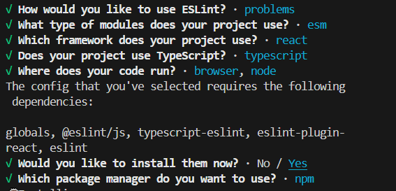
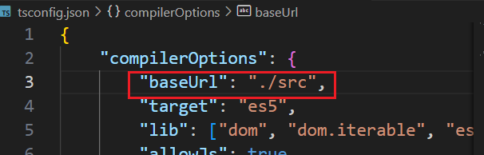

# 使用create-react-app脚手架新建一个TS项目，并配置Eslint和Prettier

## 新建项目

```shell
npx create-react-app react_ts_demo  --template typescript
```

## 下载并初始化Eslint

```shell
npm i eslint -D
npm init @eslint/config
```

按照实际需求选择 

### 配置eslint.config.mjs

### 配置.eslintignore

```shell
# ./
*.sh
node_modules
*.md
*.woff
*.ttf
.vscode
.idea
dist
/public
/docs
.husky
.local
/bin
Dockerfile
```

## 下载并初始化Prettier

```shell
npm install --save-dev --save-exact prettier
```

### 配置.prettierrc.js

```js
/* ./ */
module.exports = {
    printWidth: 100, //一行的字符数，如果超过会进行换行，默认为80
    tabWidth: 4, // 一个 tab 代表几个空格数，默认为 2 个
    useTabs: false, //是否使用 tab 进行缩进，默认为false，表示用空格进行缩减
    singleQuote: true, // 字符串是否使用单引号，默认为 false，使用双引号
    semi: true, // 行尾是否使用分号，默认为true
    trailingComma: 'none', // 是否使用尾逗号
    htmlWhitespaceSensitivity: 'strict', // HTML空白敏感度
    bracketSpacing: true, // 对象大括号直接是否有空格，默认为 true，效果：{ a: 1 }
    proseWrap: 'never' // 换行设置
};
```

### 配置.prettierignore

```shell
# ./
/dist/*
.local
.output.js
/node_modules/**
**/*.svg
**/*.sh
/public/*
```
可以在命令行执行`npx prettier -w .`就会使用prettier格式化所有文件
## 结合Prettier和Eslint
```shell
npm i eslint-config-prettier eslint-plugin-prettier -D
```
`eslint-config-prettier`用来覆盖 ESLint 本身的规则配置，

`eslint-plugin-prettier`则是用于让 Prettier 来接管eslint --fix即修复代码的能力。
*在tsconfig.json中添加baseURL属性*

[参考文章（稀土掘金）](https://juejin.cn/post/7239987776552714300)

# 封装自己的Axios
*将Axios内容封装在./src/server/http中*
**首先安装axios`npm install axios -g`**
## 定义MyAxios的类型
*此处应该根据设计，规定属性值和类型*
## 定义MyAxios类
#### 定义构造器constructor(options)传入配置选项
+ 创建axios实例
+ 私有化配置选项和拦截器
+ 初始化拦截器
#### 重写request函数，进而重写get、post、put、delete请求
调用axios实例上的request方法
#### 实现初始化拦截器函数
+ 判断是否传入了拦截器
+ 挂载请求的成功和失败拦截器
+ 挂载响应的成功和失败拦截器
+ 处理多次重复请求只保留第一个的逻辑（调用实现的函数）
## 处理重复请求
对于一个同样的请求再没返回结果之前，其他重复的发起的请求都等待或取消
实现一个取消请求的类AbortAxios，包含添加控制器和清除重复请求的方法
在请求拦截器中
## 处理请求报错自动重发
## 实例化MyAxios，继承RequstInterceptors，完善响应部分的处理
#### 继承RequstInterceptors
+ 判断请求是否取消
+ 检查响应状态码
+ 实现错误重连
#### 实例化
```ts
const useRequest = new MyAxios({
    directlyGetData: true,
    baseURL: staticAxiosConfig.baseUrl,
    timeout: 2000,
    interceptors: _RequstInterceptors,
    abortRepetitiveRequest: true,
    retryConfig: {
        count: 5,
        waitTime: 500
    }
});
```
别忘了将useRequest暴露出去
```ts
export default useRequest;
```