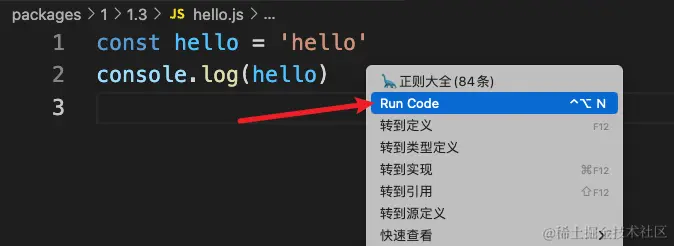
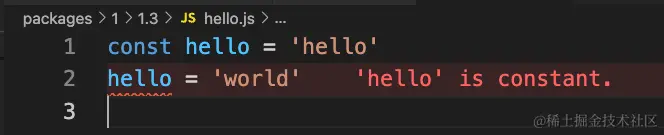
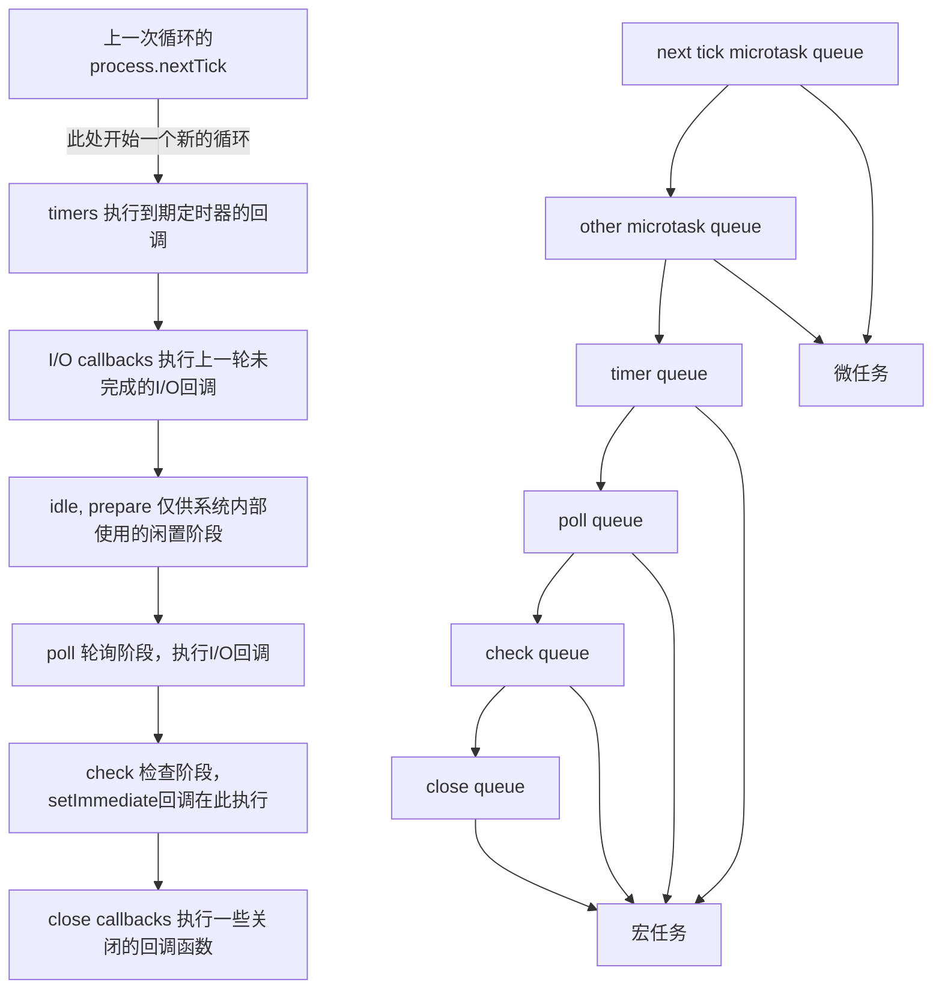

# day 01 *2024/07/25*
## 安装node版本管理工具nvm
## 安装vscode插件
+ Code Runner -- 直接运行js代码

+ Error Lens -- 直接显示错误信息

## npm使用与介绍
### 切换源
#### 手动切换
```shell
# 查看当前镜像源
npm config get registry
# 切换镜像源
npm config set registry https://registry.npmmirror.com
```
#### 使用镜像管理工具
```shell
# 安装镜像管理工具
npm i -g yrm --registry=https://registry.npmmirror.com
# 调整一下淘宝源地址
yrm add taobao https://registry.npmmirror.com
# 查看可用源
yrm ls
# 切换源
yrm use taobao
# 添加自定义源
yrm add <registry> <url>
```
### npm 常用命令
```shell
# 查看当前版本
npm -v
# 初始化项目
npm init -y
# 作为 dependencies 安装
npm install <package> / npm i <package>
# 作为 devDependencies 依赖安装
npm i <package> -D
# 全局安装
npm install -g <package>
# 卸载包
npm uninstall <package>
# 更新包
npm update <package>
# 查看安装包信息
npm info <package>
# 查看全局安装路径
npm root -g
# 运行
npm index.js
```
##### run
用于运行`npm`自定义指令，需要配合`package.json`中的`scripts`一起使用
```json
{
  "scripts": {
    "server": "node index.js",
    "hello": "echo hello world",
    "test": "node test.js"
  }
}
```
### package.json
Node.js 项目中的配置文件，用于描述项目的基本信息、依赖关系和脚本等细节信息。
1. name
描述包名，每个包名在 npm 上都是独一无二的，一般由`小写字母`与连字符`-`构成。也支持带有`scope`，如`@scope/name`
```json
{
  "name": "@vue/cli"
}
```
2. version
描述包版本，通常结构是`major.minor.patch`即`主版本号.次版本号.修订号`
```json
{
  "version": "1.0.0"
}
```
3. description: 描述包的简短信息
4. main
描述包的入口文件，即`require('moduleName')`时返回的内容。
```json
{
  "main": "index.js"
}
```
5. scripts
自定义npm命令脚本
```json
{
  "scripts": {
    "test": "echo \"Error: no test specified\" && exit 1"
  }
}
```
6. keywords
设置包的关键字，便于检索
```json
{
  "keywords": ["test","demo"]
}   
```
7. dependencies  
`dependencies`标明生产环境下需要用到的包 (运行这个包必备的外部其它依赖);  
`devDependencies`标明开发环境下需要用到的包 (开发这个包时才用到的依赖)。  
`~`符号：保持主版本号和次版本号不变，只更新小版本号。例如 "~1.2.3" 表示安装 1.2.x 系列的最新版本；  
`^`符号：保持主版本号不变，更新次版本和小版本号。例如 "^1.2.3" 表示安装 1.x.x 系列的最新版本。
### node_modules 依赖的存放路径
### package-lock.json 主要用于锁定项目依赖的版本号，以确保在不同的机器和环境中安装相同的依赖和版本。
### .npmrc 文件是 NPM 的配置文件，它包含了一些 NPM 的配置信息，比如代理、镜像、命令别名等

## CommonJS
CommonJS 是一种 JavaScript 环境中模块化编程的规范。它定义了一套模块化导入和导出的语法和机制，旨在解决 JavaScript 在模块化方面的缺陷。
+ 使用require 和 module.exports / exports 进行模块导入和导出   
    建议使用module.exports导入，虽然exports实际上是module.exports的引用，但是直接对exports赋值时，会覆盖module.exports的引用，导致该模块不能导出任何内容。
## ES Modules规范
+ 使用export default导出默认模块，使用import导入默认模块
+ 使用export xxx导出具体模块，使用import {xxx} from 'module'导入具体模块
+ Node.js正确识别ESM模块的方式
    + 使用`.mjs`作为文件后缀
    + 在package.json中添加`"type": "module"`
## CJS与ESM的差异
1. 加载时机
    + CJS支持动态加载模块，require()可以出现在任意位置
    + ESM会在所有模块加载完之后才执行代码。ESM是静态解析的，最低要求时将import放在使用之前即可；可以在执行之前进行静态分析和优化，提高性能。
2. 导出内容
    + CJS导出的是内容的拷贝，不随模块的改变而改变
    + ESM导出的是内容的引用，会随模块的改变而改变

## 常用内置模块
|模块名称|	说明|
|----|----|
|[global](https://nodejs.cn/api/v20/globals.html)|	全局对象，挂载了一些常用方法和属性|
|[path](https://nodejs.cn/api/v20/path.html)|	提供与文件路径相关的实用工具方法|
|[fs](https://nodejs.cn/api/v20/fs.html)|	文件系统模块，用于操作文件和目录|
|[util](https://nodejs.cn/api/v20/util.html)|	提供一些实用工具函数|
|[http](https://nodejs.cn/api/v20/http.html)|	用于创建 HTTP 服务器，也可用于向已有服务发起请求并获取响应|
|[child_process](https://nodejs.cn/api/v20/child_process.html)|	用于创建操作子进程|
|其它常用的工具模块	|[url](https://nodejs.cn/api/v20/url.html)，[Timers](https://nodejs.cn/api/v20/timers.html)，[Readline](https://nodejs.cn/api/v20/readline.html)，[crypto](https://nodejs.cn/api/v20/crypto.html)|

## global全局对象、path路径处理、fs文件系统、util工具模块、http服务器 可以使用时查阅文档或[掘金小册](https://juejin.cn/book/7304230207953567755/section/7304642080868204555?enter_from=search_result&utm_source=search)
## child_process子进程
+ spawn方法 -- 相当于命令行执行器
```js
import ChildProcess from 'child_process'
const { spawn, spawnSync } = ChildProcess
const file = './../fs/index.mjs'
const spawnProcess = spawn('git', ['log', '-1', '--pretty="%ci"', file])
spawnProcess.stdout.on('data', (data) => {
  console.log(`stdout: ${data}`)
  console.log(new Date(data))
})
```
+ exec方法 -- 感觉是起一个子线程执行命令
```js
import { exec, execSync } from 'child_process'
const pwd = execSync('pwd')
console.log(pwd.toString())
const ls = execSync('ls -lh')
console.log(ls.toString())

const file = './../fs/index.mjs'
const execProcess = exec(`git log -1 --pretty="%ci" ${file}`)
execProcess.stdout.on('data', (data) => {
  console.log(`stdout: ${data}`)
  console.log(new Date(data))
})
```
+ execFile方法 -- 执行某个可执行文件
```js
import { execFile, execFileSync } from 'child_process'

const file = './hello'
const execData = execFileSync(file)
console.log(execData.toString())

execFile(file, (error, stdout, stderr) => {
  if (error) {
    throw error
  }
  console.log(stdout)
  console.log(stderr)
})
```
+ fork方法 -- 创建子进程

##  事件循环

https://vue3js.cn/interview/NodeJS/event_loop.html
https://dev.nodejs.cn/learn/understanding-process-nexttick/

## 基于Express开发一个Web服务器
https://juejin.cn/book/7304230207953567755/section/7304644622452523062?enter_from=search_result&utm_source=search
### 常用方法
+ `app.all( , (req, res) => {})` 识别所有的请求方法
+ express默认不支持解析传递的请求体数据，可以使用中间件express.json()来解析json数据
  ```js
  const app = express();
  app.use(express.json())
  ```
+ app.route()创建链式路由，避免重复书写路由路径
  ```js
  app
  .route('/route/any')
  .all((req, res, next) => {
    console.log('pre all', req.method, req.path)
    next()
  })
  .get((req, res) => {
    console.log('get request')
    res.send('get request')
  })
  .post((req, res) => {
    console.log('post request')
    res.send('post request')
  })
  ```
+ 响应数据 -- 回调函数中的res参数
  + res.send()发送任意类型的数据
  + res.download()用于下载文件`res.download(path.resolve('./package.json'))`
+ 设置Response Header
  + `res.set(field, value)`
  + `res.get(field)`


# Day 02 *2024/07/26*
## 基于Express开发一个Web服务器
### 设置静态资源代理  
  在启动文件app.js中使用`app.use(express.static('public'))`
  其中public为静态资源文件夹
### 文件上传
*利用第三方库，busboy、multer、formidable等*
+ 安装依赖 `npm i multer`
+ 
